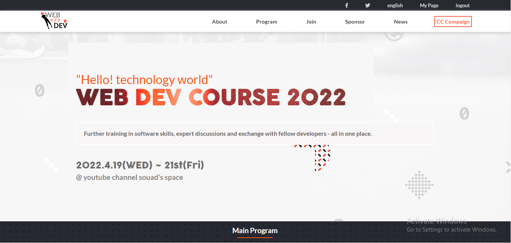
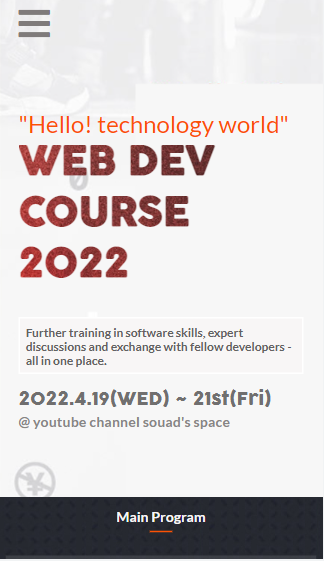

# Capstone Project: Web Dev Course 2022

> This is the first capstone project from microverse. this project is a website for web developement schools, were students can see new courses info programs and teachers .

## Screenshots

- **Laptops/Desktops:**

---

- **Mobile:**

---

## Built With

- HTML/CSS
- JS
- Technologies:
  - Git/Github
  - Fontawesome

## Live Demo

[Live Demo Link](https://souad988.github.io/S-EL-DevSchool/)

## Intro video

> By watching this short video, you will have a better understanding of our project and mission.

[S_EL_WEBDEV?](https://www.loom.com/share/843c6c437bec450b874e5c855c6c4147)

## Getting started

To get a local copy up and running follow these simple example steps.

Clone the repo with `git clone git@github.com:souad988/S-EL-DevSchool.git`

Run `npm install` from the command line

Run `npx hint .` to test for HTML linting check

Run `npx stylelint "**/*.{css,scss}"` to test for css/scss linting check

Run `npx eslint .` to test for javascript linting check

The app is deployed using Github Pages. You can view it by clicking the [Live Demo Link](#Live-Demo) above.

## Author

👤 **Souad El Mansouri**

- GitHub: [https://github.com/souad988](https://github.com/souad988)
- Twitter: [@souadElmansouri](@souadElmansouri)
- LinkedIn: [www.linkedin.com/in/souad-el-mansouri-4725491a0](www.linkedin.com/in/souad-el-mansouri-4725491a0)

## 🤝 Contributing

Contributions, issues, and feature requests are welcome!

Feel free to check the [issues page](../../issues/).

## Acknowledgments

- This website is based off of [Cindy Shin's](https://www.behance.net/adagio07) design on Behance.
- Here's is the link to the [design work](https://www.behance.net/gallery/29845175/CC-Global-Summit-2015).
- This work is under the CC Commons license 4.0

## Show your support

Give a ⭐️ if you like this project!

## 📝 License

This project is [MIT](./MIT.md) licensed.
